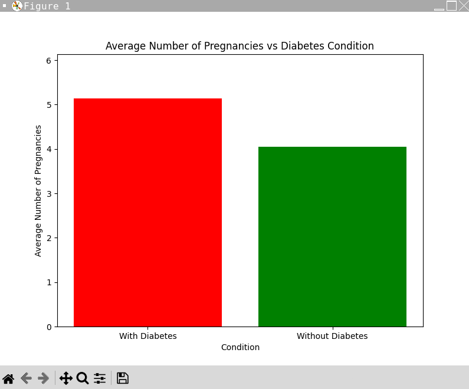

# Exploring the Link Between Pregnancy and Glucose Levels in Predicting Diabetes

This project investigates the association between pregnancy count and glucose levels in predicting the risk of diabetes. Utilizing a dataset, specifically the Pima Indians Diabetes Database, this Python script performs data cleaning, statistical analysis, and visualization to explore how these factors might contribute to diabetes risk.

## Getting Started

These instructions will get you a copy of the project up and running on your local machine for development and testing purposes.

### Prerequisites

You'll need Python installed on your system, along with the Pandas, NumPy, and Matplotlib libraries. You can install them using pip if they are not already installed:

```bash
pip install pandas numpy matplotlib
```

### Installation

1. Clone the repo to your local machine:
   ```bash
   git clone https://github.com/dmart210/Exploring-the-Link-Between-Pregnancy-and-Glucose-Levels-in-Predicting-Diabetes.git
   ```
2. Ensure you have the required libraries installed (as mentioned in Prerequisites).

### Usage

Run the script from the command line:

```bash
python HealthCode.py
```

This will execute the data cleaning, analysis, and visualization process, outputting the results to your terminal and displaying the plots graphically.

## Features

- **Data Cleaning**: Removes outliers based on the Interquartile Range (IQR) of pregnancies in the dataset.
- **Data Analysis**: Queries the cleaned data to separate individuals into groups based on glucose levels and whether they have pregnancies above zero.
- **Data Visualization**: Uses Matplotlib to create a bar chart comparing the average number of pregnancies for individuals with and without diabetes.

## Contributing

Feel free to fork this repository and submit pull requests to contribute to this project. For major changes, please open an issue first to discuss what you would like to change.

## Acknowledgments

- Pima Indians Diabetes Database for providing the dataset.
- Inspiration from medical studies linking pregnancy to diabetes risks.


## Picture Output 


## Console output
```bash
Mean of Pregnancies of women with diabetes: 5.13
Mean of Pregnancies of women without diabetes: 4.04
Using these discoveries we can come up with the hypothesis that:

The more pregnancies a women has, the higher likely she is to become diabetic.
```


